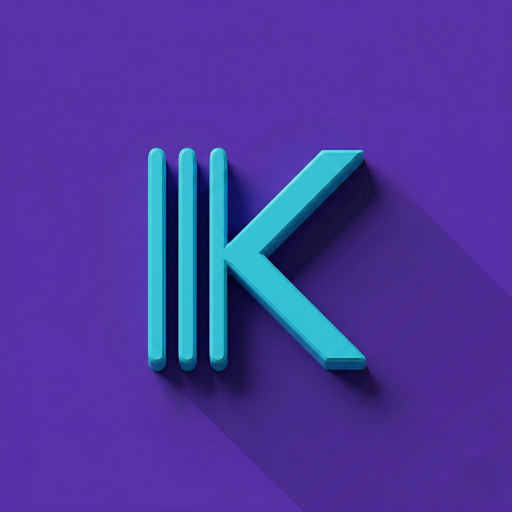
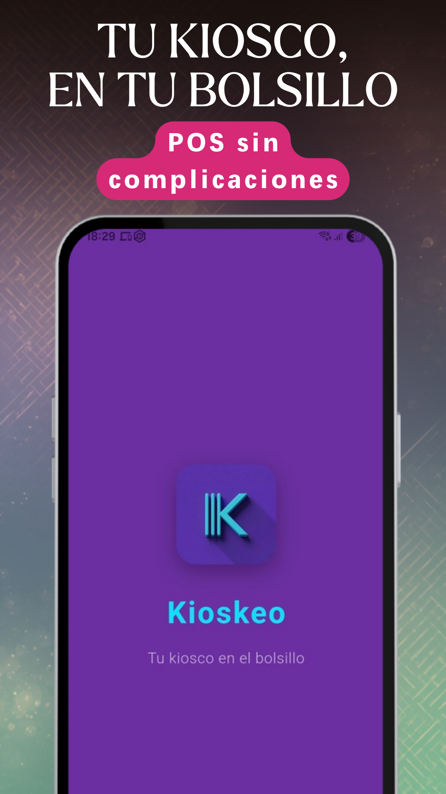
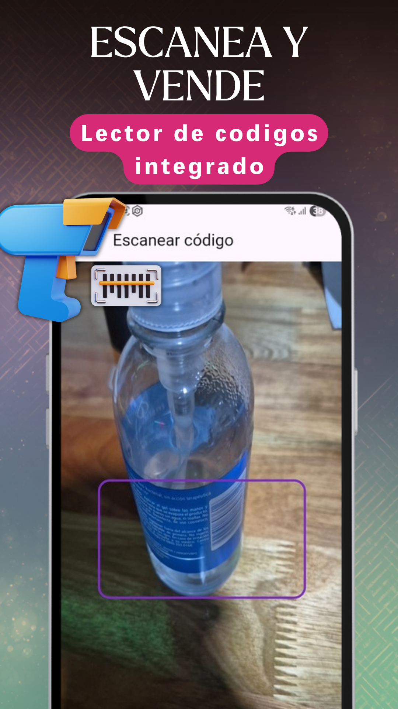
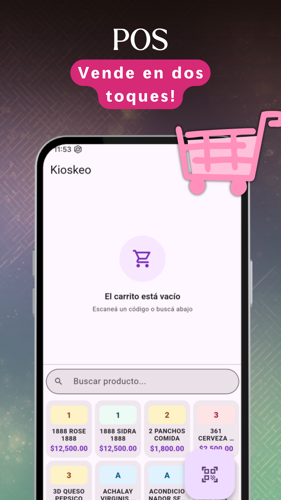
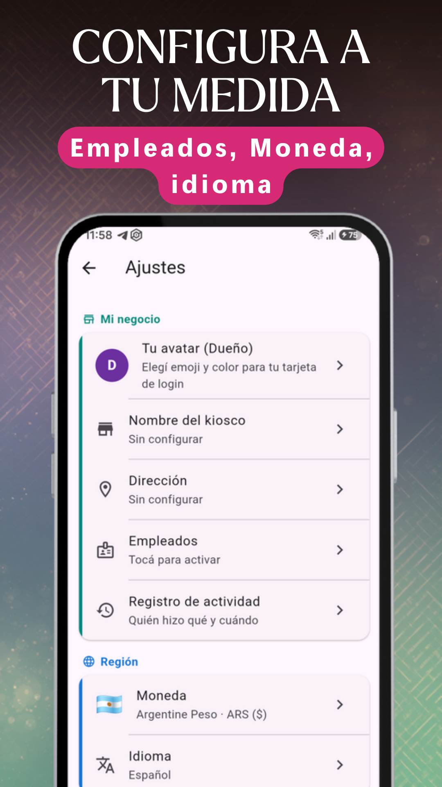
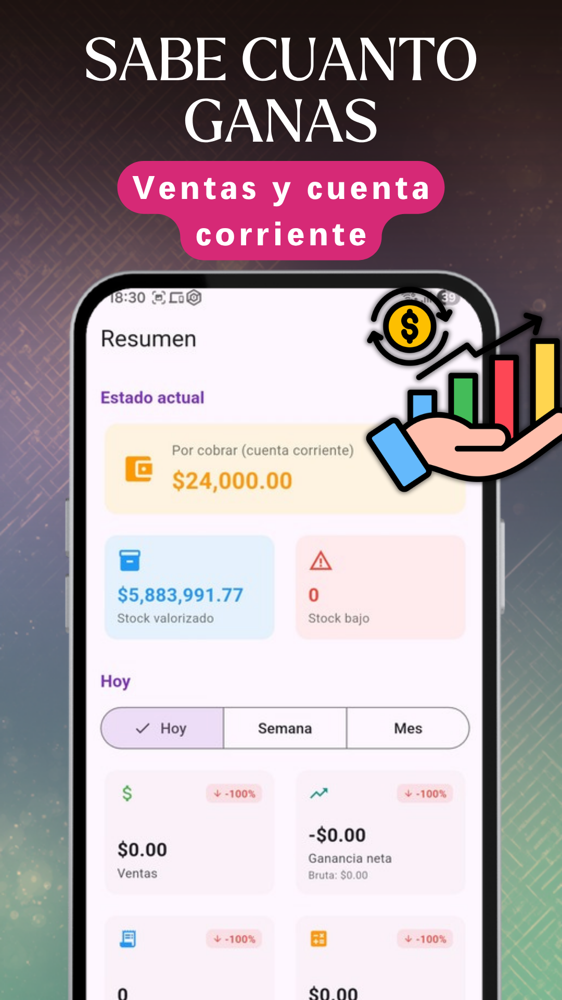
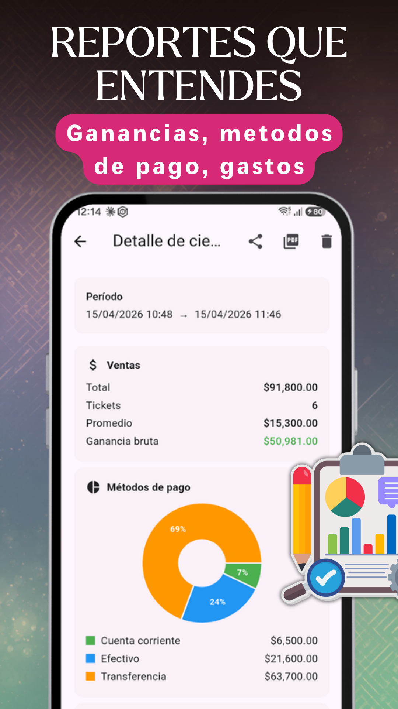
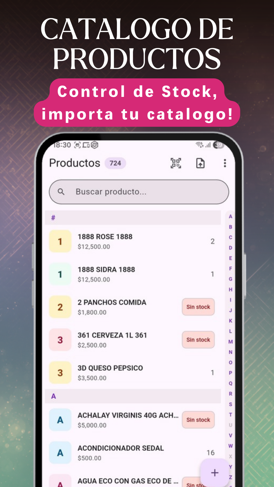
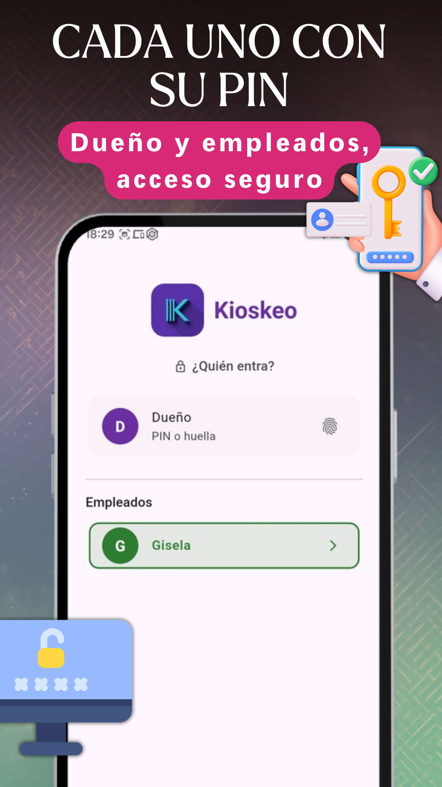

  
  <h1>Kioskeo</h1>
  
<b>Tu comercio en el bolsillo</b>

   
  

 

  <b>🇦🇷 Español</b> | <a href="README-en.md">🇺🇸 English</a> | <a href="README-pt.md">🇧🇷 Português</a>

 

Punto de venta (POS) para kioscos, almacenes y comercios chicos, solo con el celular que ya tenés: la caja, el stock, los precios, los clientes y el cierre diario. Sin PC, sin lectores caros, sin abonos eternos. Funciona 100% offline y todo queda guardado en tu teléfono.

---

## 🔥 NUEVO EN ESTA VERSIÓN (v1.14.47)

- **El anuncio, en más pantallas:** para sostener Kioskeo gratis, el anuncio chico ahora también aparece en Caja, Clientes, Registros y Ajustes.
- **En la venta, solo con el carrito vacío:** con el carrito vacío se ve un anuncio chico. Apenas cargás un producto desaparece: nunca mientras cobrás. Si tenés PRO, no ves ninguno.

### En la v1.14.46
- **El anuncio ya no aparece donde ibas a tocar:** su lugar queda reservado desde que abrís la pantalla, así no aparece de golpe justo donde estaba el botón "+".

### En la v1.14.45: todo gratis
- **Sin candados:** ventas y clientes ilimitados, cuenta corriente, cierres en PDF, empleados con PIN y respaldos automáticos, para todos.
- **Un anuncio chico** sostiene la app gratis. Nunca aparece mientras cobrás.
- **PRO ahora es sin publicidad:** mismo plan mensual, anual o pago único, con 7 días gratis.
- **Precios completos** en los accesos rápidos de la pantalla de venta.

👉 **[Ver el historial completo de cambios (Changelog)](CHANGELOG.md)**

---

## 📸 CAPTURAS

  
  
  
  

  
  
  
  

---

## 🛠️ FUNCIONES

### ⚡ Venta rápida
- Tocás el producto, cobrás y listo. También escaneando el código de barras con la cámara.
- Favoritos para los productos que más vendés y beep al escanear, como en la caja del súper.
- Efectivo, transferencia, tarjeta o cuenta corriente, con calculadora de vuelto.
- Descuentos con motivo y doble confirmación si superan un umbral.

### 📦 Productos
- Arrancás con 716 productos típicos de kiosco, con código de barras y precios de referencia.
- Cargá a mano, escaneando, desde CSV/Excel o leyendo el PDF de tu proveedor, con vista previa.
- Fotos, stock mínimo, costo y precio de venta; categorías con color e ícono.
- Ajustes masivos de precios (% o monto fijo, por categoría o todos).

### 🗃️ Caja
- Apertura con efectivo inicial y cierre comparando lo esperado con lo contado.
- Gastos del día e historial con el detalle por medio de pago.
- Cierres en PDF para compartir.

### 👥 Clientes y cuenta corriente
- Clientes con saldo, ventas al fiado y cobros parciales o totales.
- Historial de movimientos por cliente.

### 📊 Resumen y reportes
- Facturación, ganancia y productos más vendidos en tiempo real.
- Reportes por día, semana y mes, con gráficos.

### 🔒 Seguridad y empleados
- PIN del dueño y huella; bloqueo automático por inactividad.
- Empleados con PIN y permisos a medida: cada venta queda firmada.
- Registro de anulaciones, descuentos y cambios de stock.

### ☁️ Respaldos
- Respaldo automático cada 24 horas; se guardan los últimos 10.
- Exportá por WhatsApp, Drive o Gmail.

### 🎨 A tu medida
- Tema claro, oscuro o automático.
- Español, inglés y portugués.
- Moneda configurable: ARS, USD, EUR, BRL, MXN, CLP, UYU y más.

---

## 💎 GRATIS, Y PRO SIN PUBLICIDAD

Todas las funciones son gratis y sin límites. La versión gratis muestra un anuncio chico, nunca mientras cobrás.

Si preferís no ver publicidad, **Kioskeo PRO** la saca de toda la app y suma soporte prioritario. Plan mensual, anual o pago único, con 7 días gratis.

---

## ✅ POR QUÉ KIOSKEO

- Funciona 100% offline: si se corta internet, seguís vendiendo.
- Tus datos son tuyos: todo se guarda en tu celular, sin cuenta y sin servidores de EgeaINC. Ver la [política de privacidad](PRIVACY_POLICY.md).
- Sin cobros por cada venta.
- Hecha en Argentina y probada en kioscos reales.

---

## 💬 Feedback y soporte

Este repositorio es para que la comunidad mande **feedback, reporte errores y sugiera mejoras** de Kioskeo.

Si encontraste un bug o tenés una idea para la app:
👉 **[Abrí un issue acá](https://github.com/gabriel600r/kioskeo-feedback/issues)**

---

  <b>EgeaINC</b> · Hecho con 💜 en Argentina 🇦🇷

